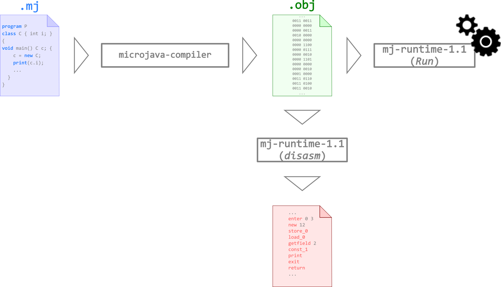

# PP1-Project-
Complier for MicroJava programming language

The compiler has four phases: 

 1) Lexical Analysis (mjlexer.lex) 
 2) Syntax Analysis (mjparser.cup)
 3) Semantic Analysis (SemanticAnalyzer.java) 
 4) Code Generation (CodeGenerator.java)

This is all compiled through the Compiler.java file.

## 	Description
 
 ## Main language features # MicroJava_Compiler


## Syntax
```
Program = "program" ident {ConstDecl | VarDecl | ClassDecl } "{" {MethodDecl} "}"
ConstDecl = "const" Type ident"="(numConst | charConst | boolConst) {, ident "=" (numConst | charConst | boolConst)} ";"
VarDecl = Type ident ["[" "]"] {"," ident ["[" "]"]} ";"
ClassDecl = "class" ident ["extends" Type] "{" {VarDecl} ["{" {ConstructorDecl} {MethodDecl} "}"] "}"
ConstructorDecl = ident "(" [FormPars] ")" {VarDecl} "{" {Statement} "}
MethodDecl = (Type | "void") ident "(" [FormPars] ")" {VarDecl} "{" {Statement} "}"
FormPars = Type ident ["[" "]"] {"," Type ident ["[" "]"]}
Type = ident
Statement = DesignatorStatement ";"
| "if" "(" Condition ")" Statement ["else" Statement]
| "while" "(" Condition ")" Statement
| "break" ";"
| "continue" ";"
| "return" [Expr] ";"
| "read" "(" Designator ")" ";"
| "print" "(" Expr ["," numConst] ")" ";"
| Designator "." "foreach" "(" ident "=>" Statement ")" ";"
| "{" {Statement} "}"
DesignatorStatement = Designator (Assignop Expr | "(" [ActPars] ")" | "++" | "‐‐")
| "[" [Designator] {"," [Designator]}"]" "=" Designator
ActPars = Expr {"," Expr}
Condition = CondTerm {"||" CondTerm}
CondTerm = CondFact {"&&" CondFact}
CondFact = Expr [Relop Expr]
Expr = ["‐"] Term {Addop Term}
Term = Factor {Mulop Factor}
Factor = Designator ["(" [ActPars] ")"]
| numConst
| charConst
| boolConst
| "new" Type ( "[" Expr "]" | "(" [ActPars] ")" )
| "(" Expr ")"
Designator = ident {"." ident | "[" Expr "]"}
Label = ident
Assignop = "="
Relop = "==" | "!=" | ">" | ">=" | "<" | "<="
Addop = "+" | "‐"
Mulop = "*" | "/" | "%"
```

```
ident = letter {letter | digit | "_"}.
numConst = digit {digit}.
charConst = "'" printableChar "'".
boolConst = ("true" | "false").
```

MicroJava has single line comment (`//`).
